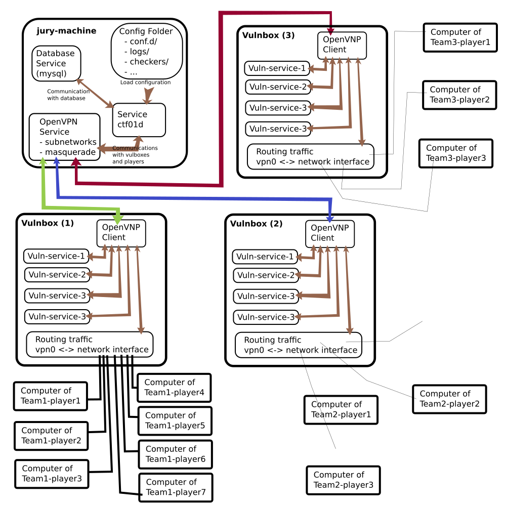

# For Maintainers

## Online Attack-Defense

I have only one schmea now:



## example for using binary ctf01d on host machine (without docker)

/etc/systemd/system/ctf01d.service
```
[Unit]
Description=CTF01D
After=syslog.target
After=network.target

[Service]
WorkingDirectory=/root
User=root
Group=root
ExecStart=/bin/sh -c '/usr/bin/ctf01d start -s > /var/log/ctf01d/access.log 2> /var/log/ctf01d/error.log'

TimeoutSec=30
Restart=always

[Install]
WantedBy=multi-user.target
Alias=ctf01d.service
```
and start it:
```
$ sudo chmod 644 /etc/systemd/system/ctf01d.service
$ sudo systemctl restart myservice
```

or init.d script:

```
#!/bin/bash
# myapp daemon chkconfig: 345 20 80 description: myapp daemon processname: myapp
DAEMON_PATH="/usr/share/ctf01d/jury.d/"
DAEMON="ctf01d"
DAEMONOPTS=" start"
NAME=adjd
DESC="ctf01d - jury ctf-scoreboard"

PIDFILE=/var/run/$NAME.pid
SCRIPTNAME=/etc/init.d/$NAME
case "$1" in
start)
	printf "%-50s" "Starting $NAME..."
	cd $DAEMON_PATH
	PID=`$DAEMON $DAEMONOPTS > /dev/null 2>&1 & echo $!`
	#echo "Saving PID" $PID " to " $PIDFILE
        if [ -z $PID ]; then
            printf "%s\n" "Fail"
        else
            echo $PID > $PIDFILE
            printf "%s\n" "Ok"
        fi ;; status)
        printf "%-50s" "Checking $NAME..."
        if [ -f $PIDFILE ]; then
            PID=`cat $PIDFILE`
            if [ -z "`ps axf | grep ${PID} | grep -v grep`" ]; then
                printf "%s\n" "Process dead but pidfile exists"
            else
                echo "Running"
            fi
        else
            printf "%s\n" "Service not running"
        fi
;;
stop)
        printf "%-50s" "Stopping $NAME"
            PID=`cat $PIDFILE`
            cd $DAEMON_PATH
        if [ -f $PIDFILE ]; then
            kill -HUP $PID
            printf "%s\n" "Ok"
            rm -f $PIDFILE
        else
            printf "%s\n" "pidfile not found"
        fi
;;
restart)
  	$0 stop
  	$0 start
;;
*)
        echo "Usage: $0 {status|start|stop|restart}"
        exit 1
esac

```
